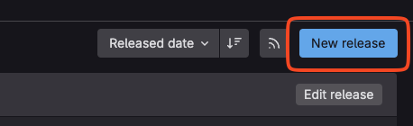
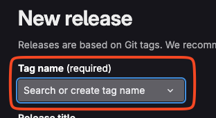
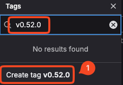
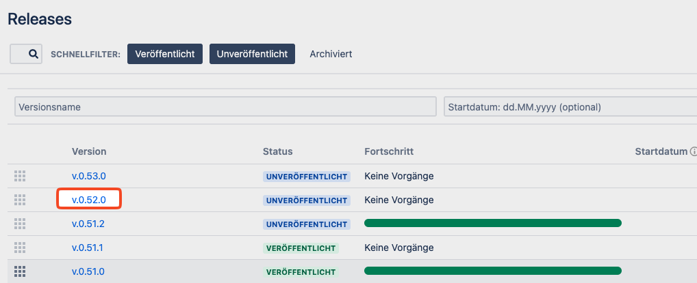
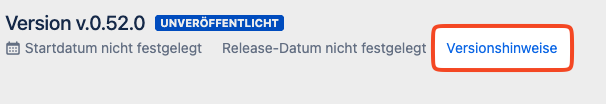
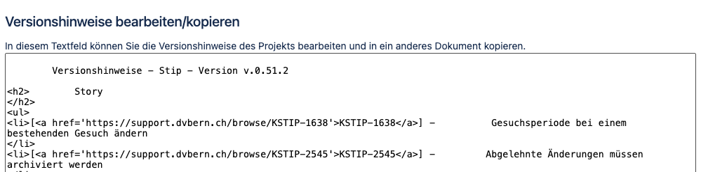
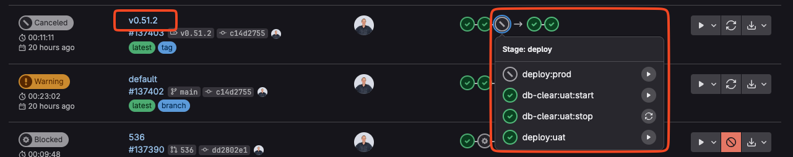

# Release Handling

1. [`Gitlab -> New release`](https://gitlab.dvbern.ch/stip/stip/-/releases/new)
    1. `Tag name` -> i.e `v0.48.0` -> `Create Tag` -> target `main`  
      
    2. `Release Title` -> same as Tag name  
      
      
    3. Copy Release notes from Jira [Release list](https://support.dvbern.ch/projects/KSTIP?selectedItem=com.atlassian.jira.jira-projects-plugin%3Arelease-page&status=released-unreleased) to `Release notes`  
        
      * Select `Versionshinweise` in the header top left  
        
      * Copy the contents of the textarea to the release notes  
        
    4. Save `Release` -> drink some coffee
2. [`Gitlab -> Pipelines`](https://gitlab.dvbern.ch/stip/stip/-/pipelines)  
  
3. On the pipeline with the used Tag name click on the 3rd circle:
    1. (If data reset is requested) Run `db-clear:uat:start`
    2. Wait for it to finish, it is possible to check the progress at [OpenShift](https://console-openshift-console.apps.apollo.ocp.dvbern.ch/topology/ns/stip-stip-default-uat?view=graph)
    3. Run `deploy:uat`
4. Test a random feature on `https://uat-stip.kibon.ch/`
5. Create an _Änderung_ on `https://uat-stip.kibon.ch/` and _Verfügung_ for an _Änderung_
