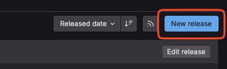
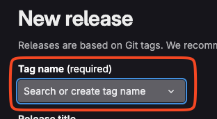
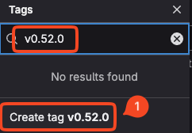
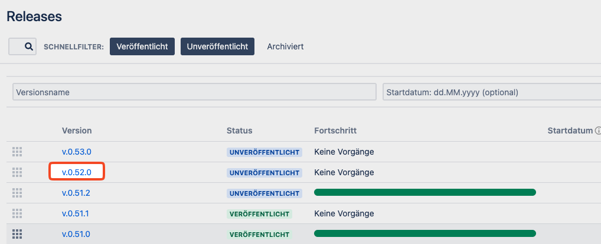
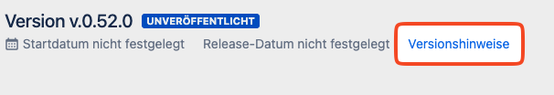
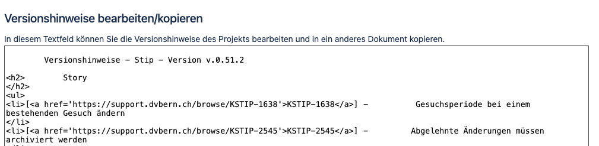
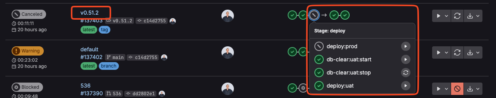

# Release Handling

1. Open [GitLab -> New release](https://gitlab.dvbern.ch/stip/stip/-/releases/new)
   1. Set `Tag name` (for example `v0.48.0`) and click `Create Tag` with target `main`.

      

   2. Set `Release Title` to the same value as the tag name.

      

      

   3. Copy release notes from Jira [Release-List](https://support.dvbern.ch/projects/KSTIP?selectedItem=com.atlassian.jira.jira-projects-plugin%3Arelease-page&status=released-unreleased) into `Release notes`.

      

      - Select `Versionshinweise` in the top-left header.

        

      - Copy the textarea content into the GitLab release notes.

        

   4. Save the release.

2. Open [GitLab -> Pipelines](https://gitlab.dvbern.ch/stip/stip/-/pipelines)

   

3. On the pipeline for the tag you used, click the third circle and:
   1. Run `deploy:uat`.
   2. If a DB clear is necessary, go to [OpenShift](https://console-openshift-console.apps.apollo.ocp.dvbern.ch): `Administrator View` -> `UAT Project` -> `Workloads` -> `CronJobs` -> `uat-stip-dbclear`. Open the job and check logs for progress.
   3. Wait until it finishes. You can monitor progress in [OpenShift](https://console-openshift-console.apps.apollo.ocp.dvbern.ch/topology/ns/stip-stip-default-uat?view=graph).

4. Test a random feature on `https://uat-stip.kibon.ch/`.

5. Create an _Aenderung_ on `https://uat-stip.kibon.ch/` and create a _Verfuegung_ for that _Aenderung_.

## Troubleshooting

If there are any problems occurring during deployment, check:

- [Argo CD Sync / Migration / Liquibase / DB Lock Problems](backend/docs/troubleshooting.md)

## Project URLs

After a release, run smoke tests on all UAT apps.

A list of all project URLs can be found in [Stip Architektur](https://intra.dvbern.ch/spaces/STIP/pages/171018259/Architektur).
