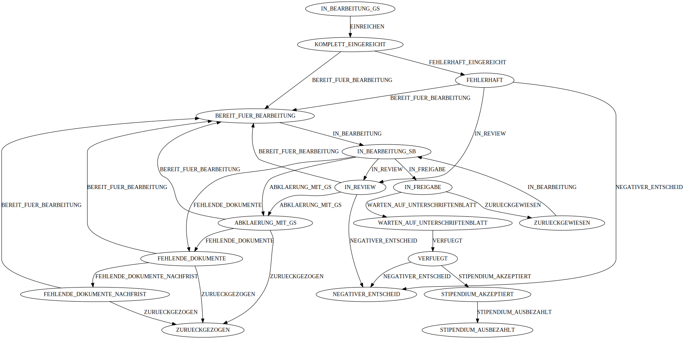

# StateMachine
For managing the `GesuchStatus` of a `GesuchFormular` we employ a finite state machine. Here is the FSM diagram:

 

## State transitions
Often we need to do something when the state machine transitions from state into another, luckily the library we use (stateless4j) supports that natively with its `onEntry` and `onExit` methods on the `StateMachineConfig`. To delegate the actual execution we implement handlers.

## Implement a handler
Implementing a new handler is as easy as implementing the [`StateChangeHandler` interface](../src/main/java/ch/dvbern/stip/api/common/statemachines/handlers/StateChangeHandler.java), you can use the full power of dependency injection in your handlers. 
