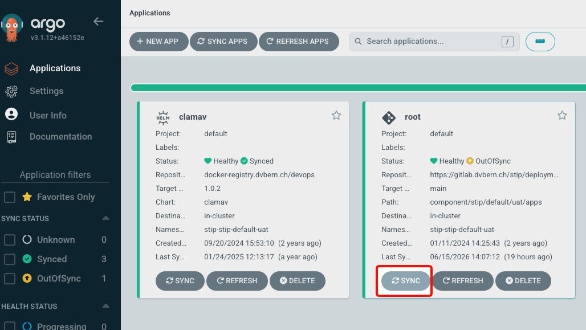

# Troubleshooting

## Deployment failure

### No visible changes after deployment

The Deployment was successfull but the App doesn't show the new Version or any of the new Features, possible causes are:

_ArgoCD Sync did not work correctly_

Check the ArgoCD instance for `OutOfSync` States in the `root` and/or `stip` Application:

- UAT: https://argocd-server-stip-stip-default-uat.apps.apollo.ocp.dvbern.ch/
- DEV: https://argocd-server-stip-stip-default-dev.apps.mercury.ocp.dvbern.ch/

If they are out of sync, run the Sync manually, shown here:

Check the other Applications after this Sync to see if the others get also out of sync and sync them as well.

## Startup failure

A startup failure could be caused by any number of issues, including but not limited to

### Liquibase fails to acquire changelog lock

Liquibase requires locking a database entry before it does anything with the schema, but sometimes (in exceptional circumstances) it fails to release the lock. In that case a manual lock reset is often required to get it working again.

1. Connect to the database instance (Postgres CLI, IntelliJ Query Console etc.)
2. Execute the following query `UPDATE databasechangeloglock SET locked=false, lockgranted=null, lockedby=null where id=1;`
