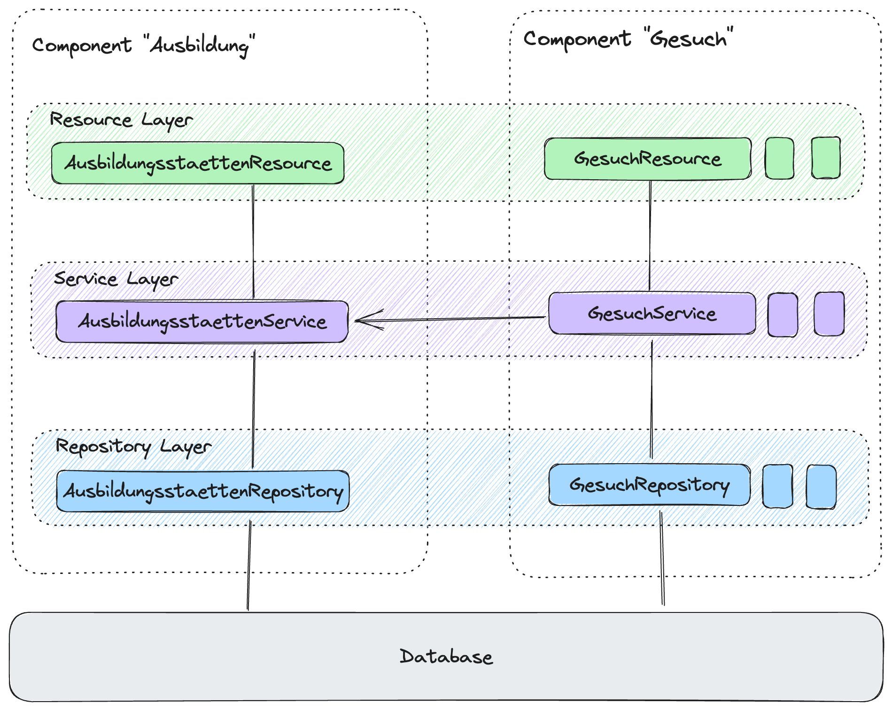
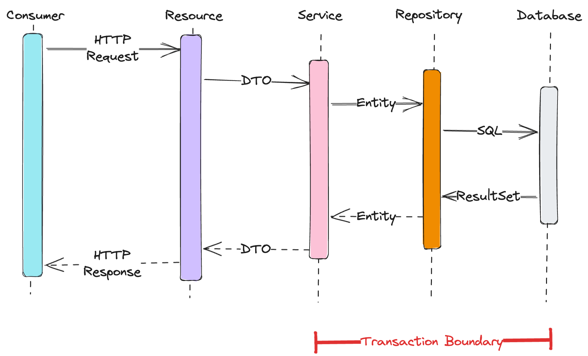

# Architecture

We use a layered architecture to divide the applications business components into multiple layers.



## Business components

A business component is a group of resources, services or repositories serving the same business case or use-case.

## Layers

Why layers? Layers allow us to technically divide an application for better maintainability and visibility. They also
allow us to define boundaries and dependencies between business components.



| Layer          | Description                                                                     |
|----------------|---------------------------------------------------------------------------------|
| **Resource**   | Consumer-facing layer                                                           |
| _Domain_       | Communication data object layer between consumer, resource and service          |
| **Service**    | Logic layer, bridge for communication between the resource and repository layer |
| _Entity_       | Persistence data object                                                         |
| **Repository** | Persistence layer, Database access layer                                        |

## Package Structure

We use the following package structure. This structure is needed to properly validate the layers across multiple
components and enforce boundaries.

```
ch.dvbern.stip.<component>.<layer>
```

## Validation

The architecture and boundaries are enforced using [ArchUnit](https://www.archunit.org/) tests. The core architecture
test is defined in [ArchitectureTest.java](../src/test/java/ch/dvbern/stip/arch/ArchitectureTest.java)