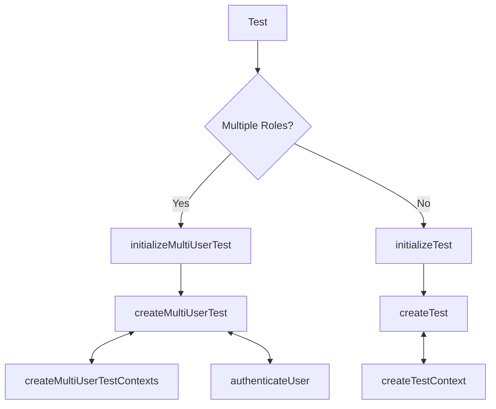

# Playwright E2E Setup Functions

### Overview of how Tests are initialized

## Multiple User Test Initialization

### `initializeMultiUserTest`

This function initializes a test with multiple user roles. It sets up the necessary contexts and provides a way to authenticate users.

## Single User Test Initialization

### `initializeTest`

This function initializes a single user test. It creates the test context and provides a way to authenticate the user.

## Info

**When should you do page.close() and when not?**

In general, you should call `page.close()` when you are done with a page and want to free up resources. However, if you are running multiple tests in parallel and need to keep the browser context alive for faster test execution, you may choose not to close the page immediately. Instead, you can reuse the page across tests.

When creating the page to be used in for example `initializeTest` and `initializeMultiUserTest`, you should should not close the page.

When using the cockpit for authentication, you should close the page after the authentication is done, as it is not needed anymore.
