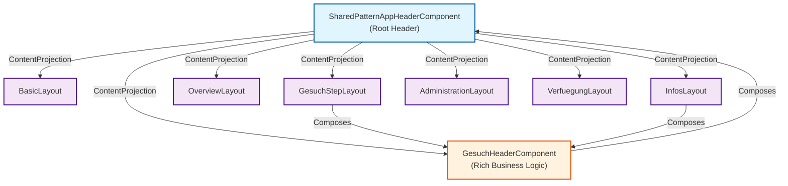
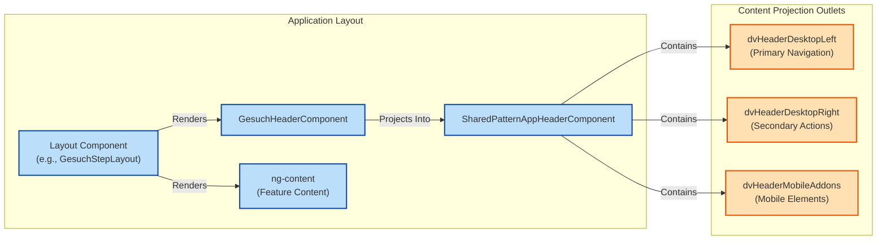
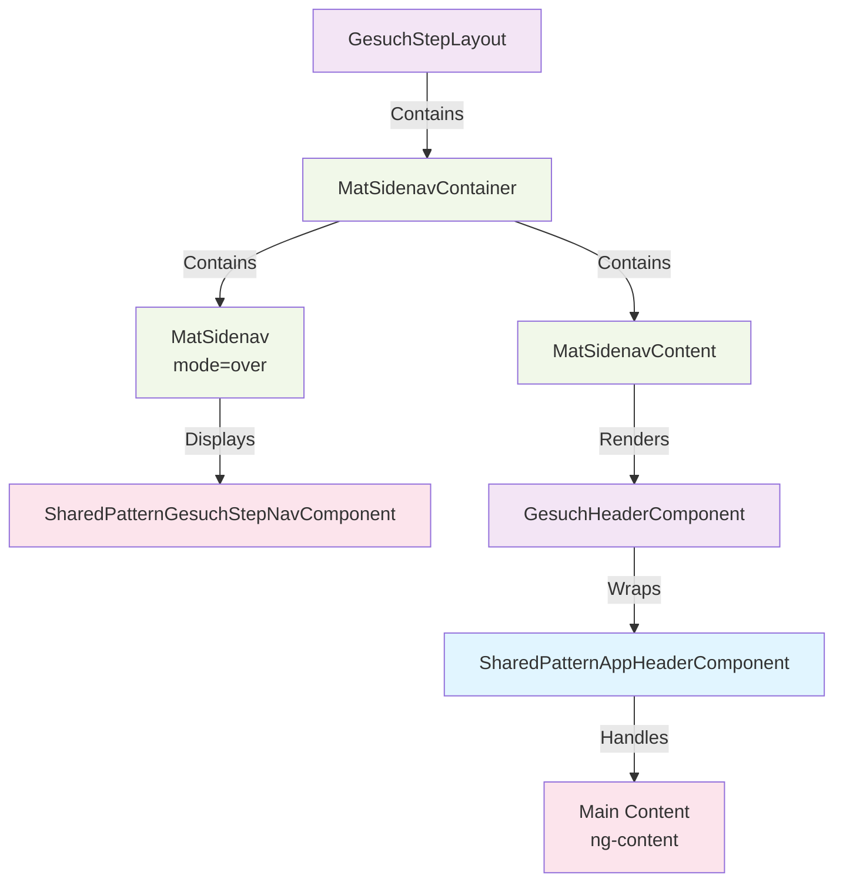
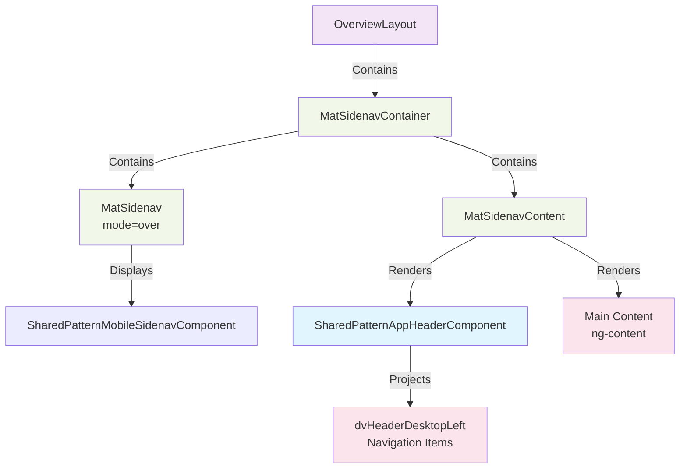

# Header and Navigation Structure

## Overview

The sachbearbeitung app uses a hierarchical layout structure with content projection to manage headers and navigation. The architecture follows Angular's component hierarchy patterns with strategic use of `ng-content` for flexible content placement.

## Visual Component Hierarchy



## Content Projection Flow



## Layout-Specific Hierarchies

### GesuchStepLayout Hierarchy



### OverviewLayout Hierarchy



## Component Hierarchy

```
SharedPatternAppHeaderComponent (Root Header)
└── Content Projection Areas:
    ├── dvHeaderDesktopLeft (Primary navigation)
    ├── dvHeaderDesktopRight (Secondary actions)
    └── dvHeaderMobileAddons (Mobile-specific elements)
```

### Layout Patterns

The app implements multiple layout patterns depending on the feature context:

#### 1. **BasicLayout** (Minimal Layout)

- **File**: `basic-layout/`
- **Usage**: Simple pages with minimal navigation
- **Structure**:
  ```
  BasicLayout
  ├── SharedPatternAppHeaderComponent
  └── <ng-content> (main content)
  ```
- **Content Projection**: Direct pass-through

#### 2. **GesuchStepLayout** (Application Step Navigation)

- **File**: `gesuch-step-layout/`
- **Usage**: Multi-step gesuch (application) forms
- **Features**:
  - Left sidebar navigation for steps (desktop)
  - Mobile drawer navigation
  - Progress indicator
  - Dynamic step validation
- **Structure**:
  ```
  GesuchStepLayout
  ├── MatSidenavContainer
  │   ├── MatSidenav (mobile drawer)
  │   │   └── SharedPatternGesuchStepNavComponent
  │   └── MatSidenavContent
  │       ├── SachbearbeitungAppPatternGesuchHeaderComponent
  │       │   └── [Custom navigation menus: Tranchen, Änderungen, Verfügung, Infos, Actions]
  │       └── <ng-content> (step content)
  ```

#### 3. **GesuchHeaderComponent** (Rich Header with Business Logic)

- **File**: `gesuch-header/`
- **Purpose**: Main navigation for application processing
- **Features**:
  - **Tranche Selection Menu**: Navigate between document tranches
  - **Modifications Menu (Änderungen)**: Track and navigate application changes
  - **Verification Link**: Access calculated verification (Verfügung)
  - **Info Link**: View application information
  - **Status Action Menu**: Trigger workflow transitions
- **Architecture**:
  - Extends `SharedPatternAppHeaderComponent`
  - Uses Angular Material menus for dropdowns
  - Manages complex business state via stores
  - Content projected into `dvHeaderDesktopLeft`
- **State Management**:
  - Tracks gesuch ID, tranche ID, revision
  - Manages tranches and modifications
  - Controls available status transitions
  - Handles document management

#### 4. **AdministrationLayout** (Admin Dashboard)

- **File**: `administration-layout/`
- **Usage**: Administrative tasks and configuration
- **Features**:
  - Left sidebar with admin options
  - Role-based navigation
  - Top navigation bar
- **Structure**:
  ```
  AdministrationLayout
  ├── MatSidenavContainer
  │   ├── MatSidenav (mobile drawer)
  │   │   └── SharedPatternMobileSidenavComponent
  │   └── MatSidenavContent
  │       ├── SharedPatternAppHeaderComponent
  │       │   └── [Top nav: Cockpit, Massendruck, Failed Payments, Administration]
  │       └── Main content area with left sidebar (desktop)
  ```

#### 5. **InfosLayout** (Application Details)

- **File**: `infos-layout/`
- **Usage**: Detailed information views for applications
- **Features**:
  - Left sidebar with info categories
  - Uses GesuchHeaderComponent for primary navigation
- **Structure**:
  ```
  InfosLayout
  ├── MatSidenavContainer
  │   ├── MatSidenav (mobile drawer)
  │   └── MatSidenavContent
  │       ├── SachbearbeitungAppPatternGesuchHeaderComponent
  │       └── Left sidebar + content area
  ```

#### 6. **OverviewLayout** (Main Dashboard)

- **File**: `overview-layout/`
- **Usage**: Dashboard and overview pages
- **Features**:
  - Minimal structure
  - Top navigation only
- **Structure**:
  ```
  OverviewLayout
  ├── MatSidenavContainer
  │   ├── MatSidenav (mobile drawer)
  │   └── MatSidenavContent
  │       ├── SharedPatternAppHeaderComponent
  │       │   └── [Top nav: Cockpit, Massendruck, Failed Payments, Administration]
  │       └── <ng-content> (main content)
  ```

## Content Projection Strategy

### Named Projection Outlets

The `SharedPatternAppHeaderComponent` provides three content projection areas:

| Selector               | Purpose                     | Scope        |
| ---------------------- | --------------------------- | ------------ |
| `dvHeaderDesktopLeft`  | Primary navigation items    | Desktop only |
| `dvHeaderDesktopRight` | Secondary actions/utilities | Desktop only |
| `dvHeaderMobileAddons` | Mobile-specific elements    | Mobile only  |

### Projection Flow Example

**GesuchStepLayout → GesuchHeaderComponent → SharedPatternAppHeaderComponent**

```html
<!-- GesuchStepLayout template -->
<dv-sachbearbeitung-app-pattern-gesuch-header (openSidenav)="sidenav.open()"> </dv-sachbearbeitung-app-pattern-gesuch-header>

<!-- GesuchHeaderComponent template -->
<dv-shared-pattern-app-header [backLink]="...">
  <div dvHeaderDesktopLeft class="tw:flex tw:grow tw:items-center tw:gap-4">
    <!-- Tranche Menu -->
    <button [matMenuTriggerFor]="gesuchMenu">...</button>
    <!-- Änderungen Menu -->
    <button [matMenuTriggerFor]="aenderungenMenu">...</button>
    <!-- Verfügung Link -->
    <a [routerLink]="['/', 'verfuegung', gesuchId]">...</a>
    <!-- Infos Link -->
    <a [routerLink]="['/', 'infos', gesuchId]">...</a>
    <!-- Status Actions Menu -->
    <button [matMenuTriggerFor]="aktionMenu">...</button>
  </div>
</dv-shared-pattern-app-header>
```

## Mobile vs. Desktop Responsiveness

- **Desktop (≥993px)**:
  - Full header with all navigation items
  - Left sidebars with additional navigation
  - Full layout visibility

- **Mobile (<993px)**:
  - Compact header with menu icon
  - Drawer-based navigation (MatSidenav with `mode="over"`)
  - Drawer opens on `openSidenav` event from header menu button

## State Management Integration

The navigation components integrate with NgRx stores for:

- **GesuchStore**: Application status, tranches, and workflow transitions
- **GesuchAenderungStore**: Track application modifications
- **GesuchInfoStore**: Application metadata and permissions
- **PermissionStore**: Role-based navigation visibility
- **EinreichenStore**: Validation states for step navigation
- **DokumentsStore**: Document and attachment management

## Key Design Patterns

1. **Hierarchical Layouts**: Layouts nest from basic to feature-specific
2. **Content Projection**: Flexible header customization without code duplication
3. **Container Components**: Layout components manage structure and state
4. **Smart Components**: Rich components (GesuchHeaderComponent) handle business logic
5. **Responsive Patterns**: Conditional rendering based on breakpoints
6. **Material Sidenav**: Drawer-based mobile navigation
7. **Menu-Driven Navigation**: Material menus for grouped navigation options

## Common Usage Pattern

```typescript
// Feature component routes to a layout component
// Layout component wraps content with navigation
// Layout composes SharedPatternAppHeaderComponent with projections
// Child content is injected via ng-content
```
